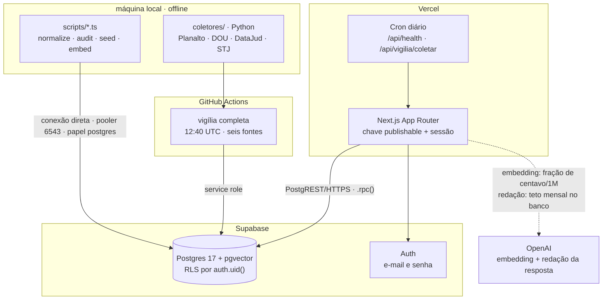
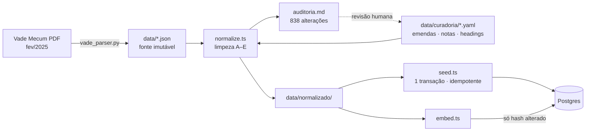
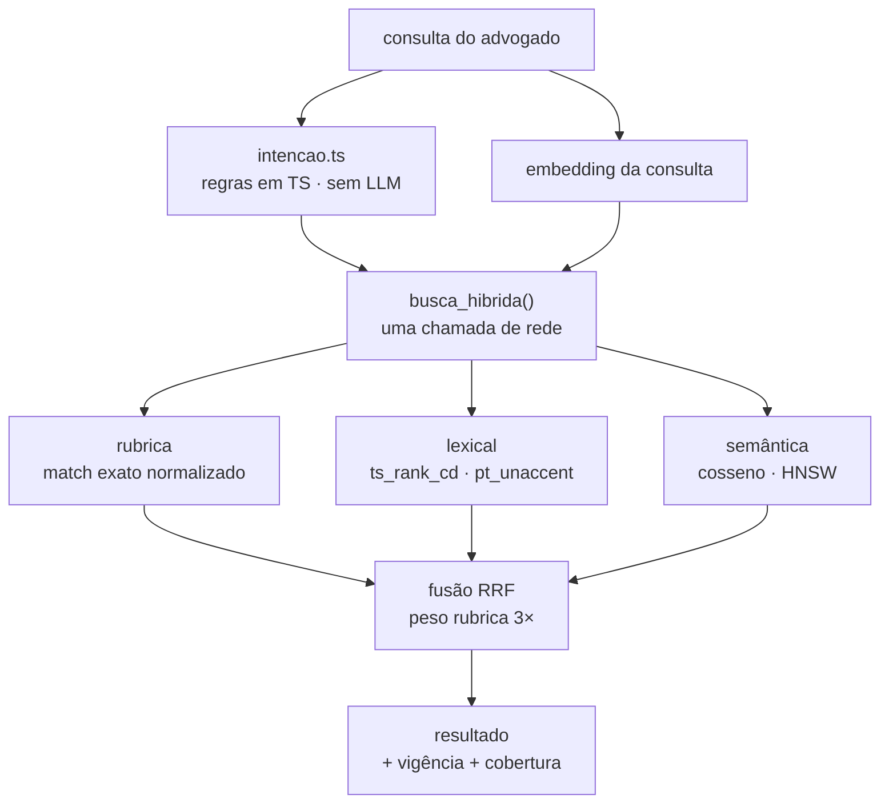
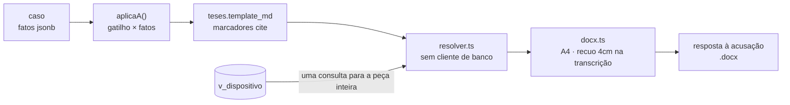
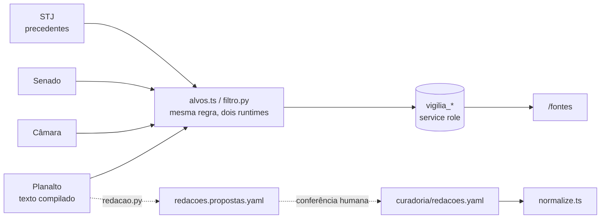

# Jesbick

**Consulta e geração de peças para advocacia criminal — recorte de tráfico de drogas.**

Busca híbrida sobre a Lei 11.343/2006, o Código Penal e o Código de Processo
Penal, com geração de resposta à acusação em que **toda citação resolve para o
texto lido do banco** — nunca para texto gerado por modelo.

Projeto de portfólio. Next.js 15 · TypeScript · Supabase (Postgres 17 + pgvector).

> **Estado atual — os cinco incrementos estão de pé.** Corpus limpo, auditado e
> conferido contra o Planalto: 3 leis, 1.340 artigos, 3.771 dispositivos, todos
> com vetor. Busca híbrida, geração de peça em DOCX, sete telas implementadas,
> autenticação, e uma vigília diária que pergunta se a data de corte envelheceu.
> O que falta é acabamento, não estrutura — a lista está no [roadmap](#roadmap).
>
> Verificação: 159 asserções em vitest e 85 em pytest, todas offline e sem
> segredo, mais 11 de navegador em Playwright.

---

## Sumário

1. [Visão do produto](#1-visão-do-produto)
2. [Arquitetura do sistema](#2-arquitetura-do-sistema)
3. [Fluxos principais](#3-fluxos-principais)
4. [Estrutura do repositório](#4-estrutura-do-repositório)
5. [Stack tecnológica](#5-stack-tecnológica)
6. [Biblioteca de documentação](#6-biblioteca-de-documentação)
7. [Arranque rápido](#7-arranque-rápido)
8. [Segurança e compliance](#8-segurança-e-compliance)
9. [Roadmap e relatório](#9-roadmap-e-relatório)

---

## 1. Visão do produto

### O problema

Um advogado criminalista montando defesa em tráfico de drogas enfrenta dois
problemas que ferramenta genérica não resolve.

**Ele não busca pelo texto da lei — busca pelo apelido do instituto.** "Tráfico
privilegiado" não aparece em lugar nenhum do art. 33, § 4º. "Roubo majorado" não
aparece no art. 157. Busca por palavra-chave no texto puro não acha o que ele
procura.

E busca semântica sozinha também não resolve. Medido neste corpus:

```
consulta: "reduzir a pena de quem é primário e não integra organização criminosa"

 1. art. 149-A, § 2º, do Código Penal      ← tráfico de PESSOAS privilegiado
 2. art. 33, § 4º, da Lei nº 11.343/2006   ← tráfico de DROGAS (o alvo)
```

A redação dos dois é quase idêntica. O vetor erra o crime.

**E o custo do erro é assimétrico.** Citar redação revogada, ou fundamento
inexistente, em peça protocolada não é bug de UX — é dano ao cliente.

### O que o sistema faz

| | |
|---|---|
| **Consulta** | busca híbrida — rubrica, lexical e semântica fundidas por RRF numa chamada de rede — com a resposta redigida por modelo sobre o contexto recuperado |
| **Peça** | seleção de caso → checklist de teses aplicáveis → minuta em DOCX, sem modelo nenhum |
| **Jurisprudência** | 61 precedentes qualificados do STJ, com a situação de cada tema |
| **Dosimetria** | cálculo trifásico ao vivo, com o art. 42 preponderando na primeira fase |
| **Vigília** | seis coletores públicos perguntando, todo dia, se a fotografia de fev/2025 envelheceu |
| **Acervo** | 75 legislações federais para leitura em `/vademecum` — separadas do corpus citável |
| **Garantia** | citação quebrada é erro de compilação, não erro em audiência |

### Escopo deliberadamente estreito

Crimes de tráfico de drogas, com Código Penal e Código de Processo Penal
disponíveis para consulta — os três em cobertura integral. Uma peça processual:
resposta à acusação (art. 396-A do CPP).

**30% do escopo com 100% de acabamento > sistema amplo e quebrado.**

Fora de escopo, por decisão: multiusuário, billing, painel administrativo,
integração com PJe, qualquer crime além de tráfico, segunda peça processual.

Autenticação saiu dessa lista: existe login por e-mail e senha, de usuário
único, sobre o Supabase Auth. Sem OAuth, sem papéis, sem perfil.

A exceção é o **acervo Vade Mecum** (`/vademecum`): 75 legislações federais de
todas as áreas, para leitura. Ele amplia a consulta sem tocar no recorte, porque
está deliberadamente fora do corpus citável — ver
[docs/acervo-vademecum.md](docs/acervo-vademecum.md).

### As três decisões que definem o projeto

1. **O texto legal nunca é gerado pelo modelo.** Toda citação resolve para um
   `dispositivos.id`. O modelo escreve apenas a argumentação *entre* as citações.
2. **A camada de rubricas é o coração da busca.** Match exato do apelido do
   instituto, com peso dominante na fusão.
3. **A data de corte é visível o tempo todo.** `vigencia_ate` em banner global e
   ao lado de cada dispositivo.

Cada uma com o porquê e o mecanismo em
[docs/decisoes-de-arquitetura.md](docs/decisoes-de-arquitetura.md).

---

## 2. Arquitetura do sistema



### Três restrições de deploy que moldam tudo

**Nenhuma conexão direta ao Postgres em runtime.** Serverless abre uma conexão
por invocação e esgota o pool. Como a busca é uma RPC única, o app usa
`supabase-js .rpc()` sobre HTTPS. Conexão direta existe só em `scripts/`, onde
compra o que importa: transação explícita, sem a qual as constraints
`deferrable initially deferred` não valem nada.

**Nenhuma rota sem sessão gasta com modelo.** A regra nunca foi "LLM é
proibido" — era que rota pública chamando modelo é superfície de gasto anônima.
A autenticação não apagou a regra; apagou o motivo de ela ser absoluta.

Hoje **a resposta do chat é gerada**, em `/api/consulta/aovivo`, com três freios
em camadas: a rota exige sessão, há limite por IP na memória do processo, e há
teto mensal no banco (`consome_uso_llm`, que decide e escreve na mesma
instrução). **A minuta continua sem modelo nenhum** — a argumentação está escrita
à mão em `teses.yaml`, e cada frase do `.docx` passou por revisão humana. Sem
chave configurada, o chat cai para uma resposta composta por função pura, que
não custa nada e não pode falhar.

**O demo precisa sobreviver à inatividade.** O plano gratuito do Supabase pausa
projetos ociosos, e um portfólio é um link clicado semanas depois. Duas defesas:
cron diário tocando o banco, e `/vademecum`, que lê do disco — com o banco
pausado, é a parte do produto que continua inteira. *(Render estático das
páginas de caso não é mais uma delas: ler cookie torna a rota dinâmica, e tudo
sob `(app)/` é servido sob demanda desde que a autenticação entrou.)*

### Componentes

| Componente | Responsabilidade |
|---|---|
| `busca_hibrida()` | fusão RRF de três estratégias, dentro do Postgres |
| `norm()` / `pt_unaccent` | normalização sem acento para match e full-text |
| triggers de validação | recusam citação para dispositivo inexistente |
| RLS | corpus somente-leitura; dado do usuário ancorado em `auth.uid()` |
| `scripts/normalize.ts` | limpeza dos artefatos de extração do PDF |
| `scripts/audit.ts` | diff das alterações no texto legal, para revisão humana |
| `lib/peca/resolver.ts` | resolve `{{cite:}}` contra o banco — a decisão nº 1 em código |
| `lib/consulta/valida.ts` | as seis recusas da resposta gerada, antes de a tela ver |
| `lib/vigilia/alvos.ts` | o filtro das ementas, puro e offline, com 31 asserções |
| `coletores/` | as seis fontes públicas da vigília, em Python |

---

## 3. Fluxos principais

### 3.1 Pipeline do corpus

Do PDF ao banco. A parte difícil do projeto mora aqui.



O ciclo pontilhado é o que importa: a auditoria alimenta a curadoria, e a
curadoria tem trava — entrada que deixa de casar **aborta** o script, em vez de
aplicar correção no escuro.

### 3.2 Busca



`p_embedding` aceita `null`: se a API de embeddings cair, a busca degrada para
rubrica + lexical e o app continua de pé. Detalhes em [docs/busca.md](docs/busca.md).

### 3.3 Geração da peça



`casos.fatos` usa as mesmas chaves de `teses.gatilho`, para o checklist ser
avaliação direta e não heurística — e `aplicaA()` é **a mesma função** que a tela
e a rota usam, para o que se confere no checklist valer para o arquivo
protocolado.

**Sem modo degradado.** Se um `{{cite:}}` não resolver, `montarPeca` lança
`CitacaoOrfa` e a rota devolve 500 com os ids. Minuta com marcador cru
envergonha; minuta com a citação silenciosamente omitida vai a juízo com
fundamento vazio.

O rodapé carrega a data de corte em toda página. Quando algum dispositivo
transcrito está em redação posterior à fotografia, ele diz quantos são e contra
o que foram conferidos — e imprime a **mais antiga** das conferências, que é a
única que cobre todos os artigos citados.

### 3.4 Vigília do corpus



**A vigília nunca escreve em `dispositivos`, `artigos` ou `leis`.** Ela avisa;
quem corrige é gente, e a assinatura é o `conferido_em` de cada entrada da
curadoria. É isso que permite o filtro ser heurístico sem pôr o corpus em risco.

O caminho pontilhado é como a redação nova entra: o scraper **propõe**, um humano
confere bloco a bloco, e só então vira corpus. Um scraper que alimentasse
`dispositivos` trocaria a fonte auditada por uma raspagem, e ninguém saberia
dizer qual dispositivo passou por olho humano.

---

## 4. Estrutura do repositório

> **Não é um monorepo.** É um pacote único: o app Next.js e os scripts de dados
> dividem o mesmo `package.json`. Com uma aplicação, nenhuma biblioteca
> publicável e nenhum time paralelo, um monorepo só adicionaria ferramenta de
> build sem resolver problema nenhum. A separação que importa aqui é outra —
> **runtime contra offline** — e ela é imposta pelo acesso ao banco, não pela
> topologia de pastas.

```
Jesbick/
├── src/
│   ├── app/
│   │   ├── (app)/              # as sete telas — exigem sessão
│   │   ├── (auth)/             # entrar, cadastrar, recuperar senha
│   │   ├── api/                # busca · consulta/aovivo · peca · health · vigilia
│   │   └── middleware.ts       # renova o token e fecha a porta por exclusão
│   ├── components/toga/        # a implementação do design system
│   └── lib/
│       ├── busca/              # intenção (regras em TS) + a RPC única
│       ├── consulta/           # contrato, validação, enriquecimento, streaming
│       ├── peca/               # resolver · montar · docx · sem cliente de banco
│       ├── vigilia/            # filtro, leitura, escrita, precedentes
│       ├── toga/               # dosimetria, histórico, marca, preferências
│       └── auth/               # rotas públicas, sessão no servidor e no cliente
│
├── scripts/                    # offline · conexão direta ao Postgres
│   ├── normalize.ts            # data/*.json + curadoria → data/normalizado/
│   ├── audit.ts                # diff texto_bruto → texto, para revisão
│   ├── seed.ts                 # → banco, uma transação, idempotente
│   ├── embed.ts                # → vetores, só o que mudou de hash
│   └── vademecum.ts            # espelho de leitura → data/vademecum/
│
├── coletores/                  # a vigília, em Python · 85 asserções offline
│   ├── planalto.py             # texto compilado — o que está EM VIGOR
│   ├── redacao.py              # propõe a atualização do corpus, não a aplica
│   └── stj.py                  # precedentes qualificados, com situação
│
├── tests/                      # 9 suítes vitest · 159 asserções · offline
│   └── corpus.ts               # pula o que exige data/normalizado/ num clone novo
├── e2e/                        # 11 asserções de navegador · Playwright
│
├── data/
│   ├── *.json                  # saída do parser — FONTE IMUTÁVEL
│   ├── curadoria/*.yaml        # intervenção manual, versionada e revisável
│   ├── normalizado/            # gerado; só auditoria.md é versionado
│   ├── vigilia/                # cache ignorado; a proposta de redação é versionada
│   └── vademecum/              # acervo de LEITURA — nunca entra no banco
│
├── supabase/migrations/        # 15 arquivos, aditivos e numerados
│   ├── 0001_schema.sql         # tabelas, funções, triggers de integridade
│   ├── 0004_rls.sql            # corpus somente-leitura
│   ├── 0010_teto_llm.sql       # teto mensal, decide e escreve na mesma instrução
│   ├── 0012_vigilia.sql        # grant por COLUNA em "marcar como conferido"
│   └── 0014_precedentes.sql    # os 61 temas do STJ
│
├── docs/                       # ver seção 6
├── CLAUDE.md                   # documento de trabalho para desenvolvimento
└── vade_parser.py              # extração do PDF — validado, não reescrever
```

---

## 5. Stack tecnológica

| Camada | Escolha | Por quê |
|---|---|---|
| Framework | Next.js 15 (App Router) | componentes de servidor lendo o banco sem API intermediária |
| Linguagem | TypeScript 5.9, `strict` + `noUncheckedIndexedAccess` | id textual é chave de citação; erro de índice não pode virar `undefined` silencioso |
| Banco | Postgres 17 (Supabase) | RRF, full-text e vetor na mesma query — a fusão acontece onde os dados estão |
| Vetores | pgvector · HNSW · cosseno | comprimento de `texto_embed` varia muito; distância angular é mais estável |
| Full-text | `pt_unaccent` (`unaccent` + `portuguese_stem`) | `'portuguese'` puro não casa "trafico" com "tráfico" |
| Autenticação | Supabase Auth · `@supabase/ssr` | sessão em cookie, não em `localStorage` — o servidor precisa enxergá-la |
| Embeddings | `text-embedding-3-small` · 1536 dims | corpus inteiro por US$ 0,0028 |
| Redação do chat | OpenAI (`gpt-5.4-mini`, via `OPENAI_MODEL`) | structured output estrito, por `fetch` cru — sem SDK no runtime |
| Coletores | Python 3.12 · `pdfplumber`, `beautifulsoup4` | scraping e extração de PDF são trabalho de lote, fora do caminho do usuário |
| Driver (scripts) | `postgres` (porsager) | transação explícita, `prepare:false` para o pooler |
| Driver (runtime) | `supabase-js` | PostgREST/HTTPS, sem pool |
| Estilo | Tailwind 4 | tokens no bloco `@theme`, uma vez só |
| Testes | vitest · pytest · Playwright | offline por padrão; navegador só onde HTML de servidor não alcança |
| Deploy | Vercel + Vercel Cron + GitHub Actions | dois andares de coleta — ver 3.4 |

---

## 6. Biblioteca de documentação

| Documento | Conteúdo | Leia se… |
|---|---|---|
| [docs/decisoes-de-arquitetura.md](docs/decisoes-de-arquitetura.md) | as 7 decisões estruturais, cada uma com contexto, motivo e mecanismo de garantia | quer entender **por que** o sistema é assim |
| [docs/corpus.md](docs/corpus.md) | as 5 classes de artefato de extração, quantificadas; heurística × curadoria; as travas | quer ver a parte difícil do projeto |
| [docs/busca.md](docs/busca.md) | fusão RRF, as três pernas, `texto_embed`, a armadilha do `IMMUTABLE` | vai mexer na busca |
| [docs/seguranca.md](docs/seguranca.md) | segredos, RLS, superfície de gasto, integridade do texto legal, direito autoral | vai revisar segurança |
| [docs/acervo-vademecum.md](docs/acervo-vademecum.md) | as 75 leis de leitura, por que ficam fora do corpus citável e como a separação é trancada | vai mexer no `/vademecum` |
| [data/normalizado/auditoria.md](data/normalizado/auditoria.md) | o diff `texto_bruto → texto` das 838 alterações, gerado | quer auditar o corpus linha a linha |
| [CLAUDE.md](CLAUDE.md) | documento de trabalho para desenvolvimento | vai contribuir com código |

Sugestão de leitura em 90 segundos: [seção 1](#1-visão-do-produto) →
[docs/corpus.md](docs/corpus.md#o-que-a-auditoria-encontrou).

---

## 7. Arranque rápido

### Pré-requisitos

- Node.js 20+ (testado em 24.19)
- um projeto Supabase (plano gratuito basta)
- chave da API da OpenAI

### Passos

```bash
git clone git@github.com:yLich-hub/Jesbick.git
cd Jesbick
npm install
```

**1. Banco.** No SQL Editor do Supabase, rode em ordem os 15 arquivos de
`supabase/migrations/`. São idempotentes e aditivos.

**2. Auth.** No painel: Authentication → Sign In / Providers → Email →
**Confirm email desligado**, e a URL do deploy na lista de Redirect URLs. Não é
código, e o fluxo trava sem isso.

**3. Variáveis.** Crie `.env.local` a partir de `.env.example`:

```bash
NEXT_PUBLIC_SUPABASE_URL=https://<ref>.supabase.co
NEXT_PUBLIC_SUPABASE_PUBLISHABLE_KEY=sb_publishable_...
OPENAI_API_KEY=sk-...
# Connect → Connection String → Transaction pooler (porta 6543)
DATABASE_URL="postgresql://postgres.<ref>:<senha>@aws-0-<região>.pooler.supabase.com:6543/postgres"
```

> Se a senha tiver `#`, `@`, `/`, `?` ou `:`, use aspas e percent-encode
> (`#` → `%23`, `@` → `%40`). Sem isso o `#` vira comentário e o resto do valor
> some sem erro nenhum.

`OPENAI_MODEL`, `SUPABASE_SERVICE_ROLE_KEY` e `CRON_SECRET` são opcionais em
desenvolvimento: sem a segunda e a terceira, a vigília não grava; sem chave de
modelo, o chat cai para a resposta composta, que não custa nada.

**4. Pipeline de dados.** Exige o PDF do Vade Mecum — ver
[como obtê-lo](#como-obter-o-pdf-de-origem).

```bash
npm run normalize    # JSONs + curadoria → data/normalizado/
npm run audit        # revise as 838 alterações antes de popular o banco
npm run seed         # → banco, uma transação, idempotente
npm run embed        # → 3.771 vetores, ~US$ 0,008
```

> **Sem este passo o app sobe, mas quatro suítes de teste se pulam.**
> `data/normalizado/` é saída determinística e não é versionada. As suítes que
> conferem id contra o corpus dizem isso e se pulam, em vez de falhar — ver
> `tests/corpus.ts`.

**5. App.**

```bash
npm run dev          # http://localhost:3000
```

### Scripts

| Comando | O que faz |
|---|---|
| `npm run dev` / `build` / `start` | ciclo Next.js |
| `npm run normalize` | limpa o corpus e gera `data/normalizado/` |
| `npm run audit` | relatório de auditoria; `-- --tudo` remove a amostragem |
| `npm run seed` | popula o banco; rodar duas vezes não duplica nem deixa resto |
| `npm run embed` | vetoriza; `-- --tudo` refaz todos |
| `npm run busca -- "consulta"` | a RPC pela linha de comando; `--lei`, `--sem-vetor` |
| `npm run vademecum` | importa o acervo de leitura; `-- --verificar-links` confere os links do Planalto |
| `npm run vigilia -- --seco` | o andar leve da coleta (Câmara e Senado), sem gravar |
| `npm run migrar -- 0015_....sql` | aplica uma migration pela conexão direta |
| **`npm run verificar`** | **lint + `tsc --noEmit` + vitest — o que se roda antes de commitar** |
| `npm run e2e` | os 11 testes de navegador; exige `E2E_EMAIL`/`E2E_SENHA` |

O lado Python tem a própria suíte, com o mesmo critério — offline e sem segredo:

```bash
.venv/Scripts/python -m pytest coletores -q          # 85 asserções
.venv/Scripts/python -m coletores --seco             # as seis fontes, sem gravar
.venv/Scripts/python -m coletores.redacao            # confere o corpus contra o Planalto
```

`tests/vigilia.test.ts` e `coletores/tests/test_filtro.py` testam a **mesma
regra** contra as **mesmas ementas reais**, em runtimes diferentes. Não é
redundância: é a trava que faz a divergência entre os dois filtros aparecer na
hora, em vez de virar uma tela dizendo que nada mudou.

---

## 8. Segurança e compliance

Resumo. Detalhamento em [docs/seguranca.md](docs/seguranca.md).

**Premissa:** usuário único, autenticado por e-mail e senha. A proteção é **por
exclusão** — `lib/auth/rotas.ts` lista o que é público e o resto exige sessão, de
modo que rota nova nasce fechada. Decisão de acesso sempre por `getUser()`, que
valida o JWT no servidor de Auth, nunca por `getSession()`, que só lê o cookie.

| Risco | Controle |
|---|---|
| Chave de escrita no bundle | apenas `NEXT_PUBLIC_*` vão ao cliente; a service role tem **um** ponto de uso em `src/`, documentado no cabeçalho do arquivo |
| Escrita vinda do cliente | corpus com `revoke insert, update, delete`; dado do usuário ancorado em `auth.uid()`; conferido sem sessão — `select` devolve `[]` e `insert` devolve 42501 |
| Escalada de "marcar como lido" para "reescrever o ato oficial" | o `grant` da vigília é **por coluna**: RLS decide linha, não coluna |
| Senha vazando pelo projeto | nenhuma tabela tem coluna de senha e nenhum código calcula hash ou emite JWT — a credencial vai direto ao servidor de Auth |
| Gasto anônimo com LLM | a rota de geração exige sessão, tem limite por IP e teto mensal no banco, decidido e escrito na mesma instrução |
| Modelo inventando lei | seis recusas no servidor antes de a tela ver, entre elas transcrição de dispositivo e parágrafo sem âncora |
| Citação para dispositivo inexistente | três camadas: `tests/citacao.test.ts` no build, triggers na escrita, e `CitacaoOrfa` derrubando a montagem da peça |
| Redação revogada exibida sem aviso | `vigencia_ate` volta em toda linha da RPC; a data sai de `DATA_DE_CORTE` ou do próprio registro, nunca de literal no JSX |
| Direito autoral de doutrina | não hospeda, não indexa, não resume; `classifica()` reconhece o pedido e a resposta o recusa |
| Dado pessoal | casos fictícios e anonimizados; a agenda de clientes é a única tabela com dado de terceiro, e vive sob RLS por sessão |

O PDF do Vade Mecum não é versionado. O `.gitignore` usa `.env*` em vez dos
padrões usuais, que deixam passar backups como `.env.local.bak`.

### Como obter o PDF de origem

O repositório não redistribui o PDF, mas ele é a cabeça da cadeia inteira — sem
ele, `vade_parser.py` não roda e o corpus não se reconstrói do zero. A edição é:

> **Vade Mecum**, Senado Federal, Coordenação de Edições Técnicas,
> **1ª edição — atualizada até fevereiro de 2025**.

Publicada na Biblioteca Digital do Senado Federal, em
<https://www2.senado.leg.br/bdsf/>. O parser espera o arquivo como
`Vade_mecum_Senado_Federal_1ed.pdf` na raiz; para apontá-lo para outro caminho,
use a variável `VADE_PDF`.

**A 2ª edição não serve como substituta**, e trocar uma pela outra é um erro
silencioso. Ela está atualizada até **junho de 2025**, quatro meses depois da
fotografia — usá-la moveria a data de corte sem que nada no projeto avisasse,
porque `leis.vigencia_ate` é escrito pelo seed a partir do que a curadoria
declara, não lido do PDF. Todo o mecanismo da decisão nº 3 passaria a carimbar
28/02/2025 sobre texto de junho. Se um dia o corpus subir para a 2ª edição, é uma
migração deliberada: nova data de corte, novo `npm run audit` revisado, e
`data/curadoria/redacoes.yaml` reconferido contra o Planalto.

---

## 9. Roadmap e relatório

### Roadmap

Incrementos verificáveis, cada um parando em estado demonstrável.

| # | Incremento | Estado |
|---|---|---|
| 1 | **Schema + seed** — migrations, limpeza do corpus, seed, embeddings | ✅ concluído |
| 2 | **Rubricas** — termos coloquiais curados e clusters `papel`/`peso` | ✅ 421 oficiais + 35 curadas, com 153 variantes |
| 3 | **Busca** — `intencao.ts`, RPC única, fusão por RRF | ✅ concluído; match contido em rubrica desde a migration 0011 |
| 4 | **Geração de peça** — teses, casos, render DOCX | ✅ `/api/peca/[casoId]`, 16 teses e 4 casos |
| 5 | **Acabamento visual** — design system TOGA v2 | ✅ sete telas implementadas |

**O que veio depois dos cinco**, sem estar previsto: autenticação de usuário
único, vigília do corpus em seis fontes, incorporação da redação nova do
Planalto, precedentes qualificados do STJ, e a resposta do chat passando a ser
gerada por modelo sobre o contexto recuperado.

**O que falta é acabamento, não estrutura.** As pendências conhecidas estão no
fim do [CLAUDE.md](CLAUDE.md) — entre elas o `art. 761` do CPP terminando em
`"art. 82.49"`, marcador de rodapé indistinguível de decimal, e as 545
divergências tipográficas entre o Vade Mecum e o Planalto, que ficam no relatório
de propósito.

### Relatório do corpus

Estado atual do banco, verificado por `public.saude()`:

| | Lei 11.343 | Código Penal | CPP | Total |
|---|--:|--:|--:|--:|
| Artigos | 94 | 421 | 825 | **1.340** |
| Dispositivos | 390 | 1.312 | 2.069 | **3.771** |
| Artigos revogados | 10 | 19 | 16 | 45 |
| Rubricas oficiais | 0 | 414 | 7 | **421** |
| Embeddings | 390 | 1.312 | 2.069 | **3.771** |

Somam-se 35 rubricas **curadas** à mão, com 153 variantes e 96 vínculos. Elas
carregam o recorte inteiro do projeto: nem a Lei de Drogas nem o CPP têm rubrica
marginal impressa no Vade Mecum, e sem a curadoria a busca erra de forma
silenciosa — medido antes de ela existir, `tráfico privilegiado` devolvia o
art. 332 do CP, que é tráfico de *influência*.

### O que a auditoria do corpus encontrou

Três classes de artefato estavam previstas. **Duas só apareceram quando os
números medidos contradisseram os esperados** — e são as duas que poriam texto
corrompido dentro de uma peça protocolada.

Os números saem de `data/normalizado/relatorio.json`, não da memória, e são a
contagem de `alteracoes[]` — uma entrada por dispositivo e regra:

| Classe | Ocorrências | Correção |
|---|--:|---|
| **A.** Rubrica marginal colada no fim do bloco | 385 | heurística + diff revisado |
| **B.** Marcador de nota de rodapé | 58 | heurística |
| **C.** Ordinal como letra `o` | 179 | determinística |
| **D.** Nota do Editor emendada no texto legal | 42 | curadoria, com trava |
| **E.** Parágrafo inexistente por remissão partida | 11 | curadoria, com trava |
| **F.** Divisor estrutural vazado para dentro do texto | 2 | heurística |
| *Subtotal — limpeza do PDF* | *677* | |
| **Redação posterior à data de corte** | 161 | curadoria, conferida contra o Planalto |
| **Total** | **838** | |

A última classe não conserta artefato nenhum, e por isso está separada: é a
redação nova que 25 leis posteriores trouxeram, incorporada ao corpus por
`data/curadoria/redacoes.yaml` depois de conferência humana bloco a bloco. Ver
[3.4](#34-vigília-do-corpus).

A classe **D** não é regex-ável com segurança: uma das notas contém
`art. 2o da Lei no 7.209/1984`, e qualquer regra do tipo "corta até o primeiro
ponto" decepa o texto legal junto.

A classe **E** é a mais grave. O art. 37 da Lei de Drogas — informante do
tráfico, dentro do recorte do projeto — saía do parser com o caput truncado em
`"arts. 33, caput e"` mais um dispositivo fantasma citável em peça.

Invariantes verificadas a cada execução, que **abortam** a pipeline: nenhum id
de dispositivo repetido, nenhum `NE:` remanescente, nenhuma entrada de curadoria
órfã, e nenhuma redação aplicada cujo texto anterior não case exatamente. E
reportadas para revisão: 0 conflitos de rubrica, 1 suspeito de truncamento — o
`art. 761` do CPP, fora do recorte, listado nas pendências.

O pipeline é determinístico: reexecutar `npm run normalize` devolve os três JSONs
byte a byte idênticos, e só o `relatorio.json` muda, pelo carimbo de hora.

Detalhamento em [docs/corpus.md](docs/corpus.md).

---

<sub>Fonte do texto legal: Vade Mecum Senado Federal, 1ª ed. — redação vigente em
28/02/2025. O PDF não é redistribuído neste repositório.</sub>
