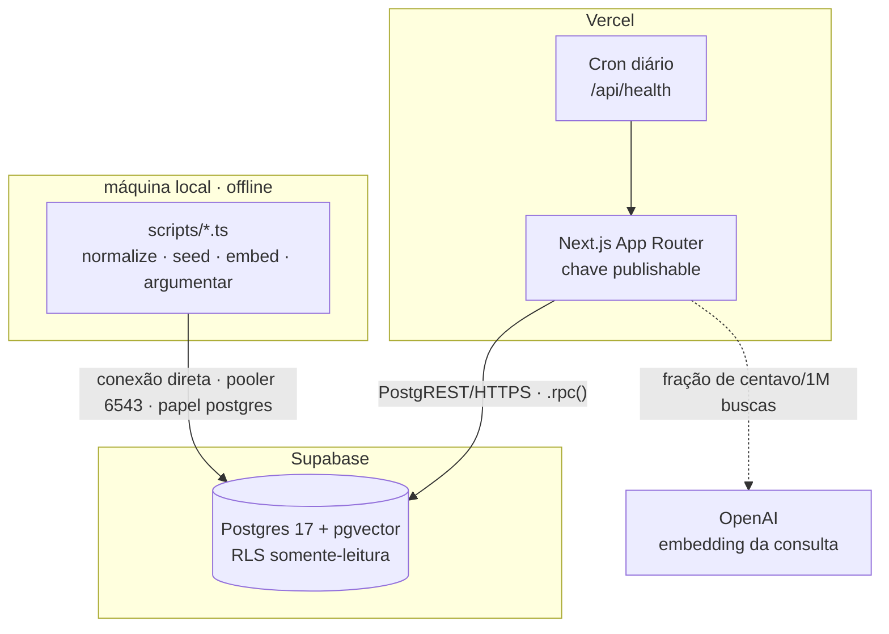
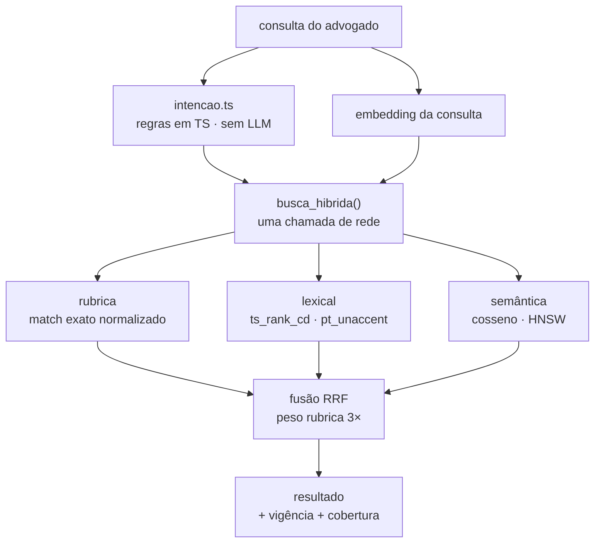
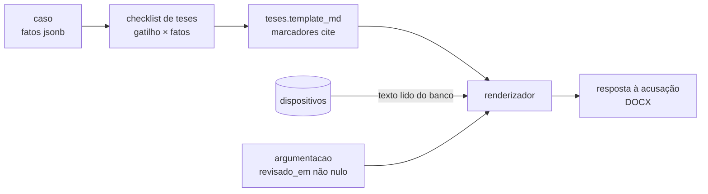

# Jesbick

**Consulta e geração de peças para advocacia criminal — recorte de tráfico de drogas.**

Busca híbrida sobre a Lei 11.343/2006, o Código Penal e um subconjunto curado do
CPP, com geração de resposta à acusação em que **toda citação resolve para o
texto lido do banco** — nunca para texto gerado por modelo.

Projeto de portfólio. Next.js 15 · TypeScript · Supabase (Postgres 17 + pgvector).

> **Estado atual — incremento 1 de 5 concluído.** Corpus limpo e auditado, banco
> populado, 1.632 embeddings e a RPC de busca verificada pelas três pernas.
> A interface ainda é um placeholder. Este documento descreve a arquitetura
> inteira; o que já existe e o que não existe está no
> [roadmap](#roadmap), e o que é projeto futuro aparece marcado como tal.

---

## Sumário

1. [Visão do produto](#1-visão-do-produto)
2. [Arquitetura do sistema](#2-arquitetura-do-sistema)
3. [Fluxos principais](#3-fluxos-principais)
4. [Estrutura do repositório](#4-estrutura-do-repositório)
5. [Stack tecnológica](#5-stack-tecnológica)
6. [Biblioteca de documentação](#6-biblioteca-de-documentação)
7. [Arranque rápido](#7-arranque-rápido)
8. [Segurança e compliance](#8-segurança-e-compliance)
9. [Roadmap e relatório](#9-roadmap-e-relatório)

---

## 1. Visão do produto

### O problema

Um advogado criminalista montando defesa em tráfico de drogas enfrenta dois
problemas que ferramenta genérica não resolve.

**Ele não busca pelo texto da lei — busca pelo apelido do instituto.** "Tráfico
privilegiado" não aparece em lugar nenhum do art. 33, § 4º. "Roubo majorado" não
aparece no art. 157. Busca por palavra-chave no texto puro não acha o que ele
procura.

E busca semântica sozinha também não resolve. Medido neste corpus:

```
consulta: "reduzir a pena de quem é primário e não integra organização criminosa"

 1. art. 149-A, § 2º, do Código Penal      ← tráfico de PESSOAS privilegiado
 2. art. 33, § 4º, da Lei nº 11.343/2006   ← tráfico de DROGAS (o alvo)
```

A redação dos dois é quase idêntica. O vetor erra o crime.

**E o custo do erro é assimétrico.** Citar redação revogada, ou fundamento
inexistente, em peça protocolada não é bug de UX — é dano ao cliente.

### O que o sistema faz

| | |
|---|---|
| **Consulta** | busca híbrida — rubrica, lexical e semântica fundidas por RRF numa chamada de rede |
| **Peça** | seleção de caso → checklist de teses aplicáveis → minuta em DOCX |
| **Acervo** | 75 legislações federais para leitura em `/vademecum` — separadas do corpus citável |
| **Garantia** | citação quebrada é erro de compilação, não erro em audiência |

### Escopo deliberadamente estreito

Crimes de tráfico de drogas, com Código Penal e um subconjunto curado do CPP
disponíveis para consulta. Uma peça processual: resposta à acusação
(art. 396-A do CPP).

**30% do escopo com 100% de acabamento > sistema amplo e quebrado.**

Fora de escopo, por decisão: autenticação, multiusuário, billing, painel
administrativo, integração com PJe, qualquer crime além de tráfico.

A exceção é o **acervo Vade Mecum** (`/vademecum`): 75 legislações federais de
todas as áreas, para leitura. Ele amplia a consulta sem tocar no recorte, porque
está deliberadamente fora do corpus citável — ver
[docs/acervo-vademecum.md](docs/acervo-vademecum.md).

### As três decisões que definem o projeto

1. **O texto legal nunca é gerado pelo modelo.** Toda citação resolve para um
   `dispositivos.id`. O modelo escreve apenas a argumentação *entre* as citações.
2. **A camada de rubricas é o coração da busca.** Match exato do apelido do
   instituto, com peso dominante na fusão.
3. **A data de corte é visível o tempo todo.** `vigencia_ate` em banner global e
   ao lado de cada dispositivo.

Cada uma com o porquê e o mecanismo em
[docs/decisoes-de-arquitetura.md](docs/decisoes-de-arquitetura.md).

---

## 2. Arquitetura do sistema



### Três restrições de deploy que moldam tudo

**Nenhuma conexão direta ao Postgres em runtime.** Serverless abre uma conexão
por invocação e esgota o pool. Como a busca é uma RPC única, o app usa
`supabase-js .rpc()` sobre HTTPS. Conexão direta existe só em `scripts/`, onde
compra o que importa: transação explícita, sem a qual as constraints
`deferrable initially deferred` não valem nada.

**Nenhuma chamada a LLM em runtime.** Sem autenticação, rota pública que chama a
API do Claude é superfície de gasto anônima. A argumentação é gerada offline,
revisada à mão e servida do banco — com efeito colateral desejável: cada frase
da minuta passa por revisão humana.

**O demo precisa sobreviver à inatividade.** O plano gratuito do Supabase pausa
projetos ociosos, e um portfólio é um link clicado semanas depois. Duas defesas
somadas: cron diário tocando o banco, e páginas dos casos renderizadas
estaticamente — se o banco cair, o núcleo da demonstração continua de pé.
*(A função `public.saude()` já existe; o cron e as páginas estáticas entram nos
incrementos 4 e 5.)*

### Componentes

| Componente | Responsabilidade |
|---|---|
| `busca_hibrida()` | fusão RRF de três estratégias, dentro do Postgres |
| `norm()` / `pt_unaccent` | normalização sem acento para match e full-text |
| triggers de validação | recusam citação para dispositivo inexistente |
| RLS | leitura pública; escrita apenas pelo papel `postgres` |
| `scripts/normalize.ts` | limpeza dos artefatos de extração do PDF |
| `scripts/audit.ts` | diff das alterações no texto legal, para revisão humana |

---

## 3. Fluxos principais

### 3.1 Pipeline do corpus

Do PDF ao banco. A parte difícil do projeto mora aqui.


O ciclo pontilhado é o que importa: a auditoria alimenta a curadoria, e a
curadoria tem trava — entrada que deixa de casar **aborta** o script, em vez de
aplicar correção no escuro.

### 3.2 Busca



`p_embedding` aceita `null`: se a API de embeddings cair, a busca degrada para
rubrica + lexical e o app continua de pé. Detalhes em [docs/busca.md](docs/busca.md).

### 3.3 Geração da peça



`casos.fatos` usa as mesmas chaves de `teses.gatilho`, para o checklist ser
avaliação direta e não heurística. O texto legal entra por `SELECT`; o modelo
não tem caminho para produzi-lo.

---

## 4. Estrutura do repositório

> **Não é um monorepo.** É um pacote único: o app Next.js e os scripts de dados
> dividem o mesmo `package.json`. Com uma aplicação, nenhuma biblioteca
> publicável e nenhum time paralelo, um monorepo só adicionaria ferramenta de
> build sem resolver problema nenhum. A separação que importa aqui é outra —
> **runtime contra offline** — e ela é imposta pelo acesso ao banco, não pela
> topologia de pastas.

```
Jesbick/
├── src/
│   ├── app/                    # App Router — páginas e rotas
│   └── lib/
│       ├── normalizacao.ts     # limpeza do corpus (funções puras, testáveis)
│       ├── supabase.ts         # cliente de runtime — só chave publishable
│       └── tipos.ts            # fronteira: saída do parser × linhas do banco
│
├── scripts/                    # offline · conexão direta ao Postgres
│   ├── db.ts                   # pooler 6543, prepare:false
│   ├── normalize.ts            # data/*.json + curadoria → data/normalizado/
│   ├── audit.ts                # diff texto_bruto → texto, para revisão
│   ├── seed.ts                 # → banco, uma transação, idempotente
│   ├── embed.ts                # → vetores, só o que mudou de hash
│   ├── busca.ts                # a RPC pela linha de comando
│   └── vademecum.ts            # espelho de leitura → data/vademecum/
│
├── data/
│   ├── *.json                  # saída do parser — FONTE IMUTÁVEL
│   ├── curadoria/*.yaml        # intervenção manual, versionada e revisável
│   ├── normalizado/            # gerado; só auditoria.md é versionado
│   └── vademecum/              # acervo de LEITURA — nunca entra no banco
│
├── supabase/migrations/        # aditivas e numeradas
│   ├── 0001_schema.sql         # tabelas, funções, triggers de integridade
│   ├── 0002_indices.sql        # GIN, HNSW, trigram
│   ├── 0003_busca.sql          # view de leitura + busca_hibrida()
│   └── 0004_rls.sql            # RLS: leitura pública, escrita nenhuma
│
├── docs/                       # ver seção 6
├── CLAUDE.md                   # documento de trabalho para desenvolvimento
└── vade_parser.py              # extração do PDF — validado, não reescrever
```

---

## 5. Stack tecnológica

| Camada | Escolha | Por quê |
|---|---|---|
| Framework | Next.js 15 (App Router) | render estático das páginas de caso, que é a defesa contra o banco pausado |
| Linguagem | TypeScript 5.9, `strict` + `noUncheckedIndexedAccess` | id textual é chave de citação; erro de índice não pode virar `undefined` silencioso |
| Banco | Postgres 17 (Supabase) | RRF, full-text e vetor na mesma query — a fusão acontece onde os dados estão |
| Vetores | pgvector · HNSW · cosseno | comprimento de `texto_embed` varia muito; distância angular é mais estável |
| Full-text | `pt_unaccent` (`unaccent` + `portuguese_stem`) | `'portuguese'` puro não casa "trafico" com "tráfico" |
| Embeddings | `text-embedding-3-small` · 1536 dims | corpus inteiro por US$ 0,0028 |
| Geração | `claude-opus-5`, offline | sem LLM em runtime — ver seção 8 |
| Driver (scripts) | `postgres` (porsager) | transação explícita, `prepare:false` para o pooler |
| Driver (runtime) | `supabase-js` | PostgREST/HTTPS, sem pool |
| Estilo | Tailwind 4 | — |
| Deploy | Vercel + Vercel Cron | — |

---

## 6. Biblioteca de documentação

| Documento | Conteúdo | Leia se… |
|---|---|---|
| [docs/decisoes-de-arquitetura.md](docs/decisoes-de-arquitetura.md) | as 7 decisões estruturais, cada uma com contexto, motivo e mecanismo de garantia | quer entender **por que** o sistema é assim |
| [docs/corpus.md](docs/corpus.md) | as 5 classes de artefato de extração, quantificadas; heurística × curadoria; as travas | quer ver a parte difícil do projeto |
| [docs/busca.md](docs/busca.md) | fusão RRF, as três pernas, `texto_embed`, a armadilha do `IMMUTABLE` | vai mexer na busca |
| [docs/seguranca.md](docs/seguranca.md) | segredos, RLS, superfície de gasto, integridade do texto legal, direito autoral | vai revisar segurança |
| [docs/acervo-vademecum.md](docs/acervo-vademecum.md) | as 75 leis de leitura, por que ficam fora do corpus citável e como a separação é trancada | vai mexer no `/vademecum` |
| [data/normalizado/auditoria.md](data/normalizado/auditoria.md) | o diff `texto_bruto → texto` das 506 alterações, gerado | quer auditar o corpus linha a linha |
| [CLAUDE.md](CLAUDE.md) | documento de trabalho para desenvolvimento | vai contribuir com código |

Sugestão de leitura em 90 segundos: [seção 1](#1-visão-do-produto) →
[docs/corpus.md](docs/corpus.md#o-que-a-auditoria-encontrou).

---

## 7. Arranque rápido

### Pré-requisitos

- Node.js 20+ (testado em 24.19)
- um projeto Supabase (plano gratuito basta)
- chave da API da OpenAI

### Passos

```bash
git clone git@github.com:yLich-hub/Jesbick.git
cd Jesbick
npm install
```

**1. Banco.** No SQL Editor do Supabase, rode em ordem os quatro arquivos de
`supabase/migrations/`. São idempotentes.

**2. Variáveis.** Crie `.env.local`:

```bash
NEXT_PUBLIC_SUPABASE_URL=https://<ref>.supabase.co
NEXT_PUBLIC_SUPABASE_PUBLISHABLE_KEY=sb_publishable_...
OPENAI_API_KEY=sk-...
# Connect → Connection String → Transaction pooler (porta 6543)
DATABASE_URL="postgresql://postgres.<ref>:<senha>@aws-0-<região>.pooler.supabase.com:6543/postgres"
```

> Se a senha tiver `#`, `@`, `/`, `?` ou `:`, use aspas e percent-encode
> (`#` → `%23`, `@` → `%40`). Sem isso o `#` vira comentário e o resto do valor
> some sem erro nenhum.

**3. Pipeline de dados.**

```bash
npm run normalize    # JSONs + curadoria → data/normalizado/
npm run audit        # revise as 506 alterações antes de popular o banco
npm run seed         # → banco, uma transação, idempotente
npm run embed        # → 1.632 vetores, ~US$ 0,003
```

**4. App.**

```bash
npm run dev          # http://localhost:3000
```

### Scripts

| Comando | O que faz |
|---|---|
| `npm run dev` / `build` / `start` | ciclo Next.js |
| `npm run normalize` | limpa o corpus e gera `data/normalizado/` |
| `npm run audit` | relatório de auditoria; `-- --tudo` remove a amostragem |
| `npm run seed` | popula o banco; rodar duas vezes não duplica nem deixa resto |
| `npm run embed` | vetoriza; `-- --tudo` refaz todos |
| `npm run busca -- "consulta"` | a RPC pela linha de comando; `--lei`, `--sem-vetor` |
| `npm run vademecum` | importa o acervo de leitura; `-- --verificar-links` confere os links do Planalto |
| `npm run typecheck` / `test` | `tsc --noEmit` / vitest |

---

## 8. Segurança e compliance

Resumo. Detalhamento em [docs/seguranca.md](docs/seguranca.md).

**Premissa:** o app é público e sem autenticação — escopo deliberado. Nenhuma
proteção depende de sessão, porque não existe usuário confiável.

| Risco | Controle |
|---|---|
| Chave de escrita no bundle | apenas `NEXT_PUBLIC_*` vão ao cliente; service role e `DATABASE_URL` não têm caminho de importação até `src/` |
| Escrita vinda do cliente | RLS ligada em todas as tabelas; `revoke insert, update, delete` para `anon`; **nenhuma policy de escrita** |
| Minuta sem revisão humana | policy `using (revisado_em is not null)` — invariante do banco, não disciplina de processo |
| Gasto anônimo com LLM | nenhuma chamada a LLM em runtime; teto mensal no banco para o caminho opcional |
| Citação para dispositivo inexistente | triggers no banco *(ativos)* + teste que falha o build *(incremento 4)* |
| Redação revogada exibida sem aviso | `vigencia_ate` volta em toda linha da RPC; constraint exige nota quando a cobertura é parcial |
| Direito autoral de doutrina | não hospeda, não indexa, não resume; entrega jurisprudência e link para fonte legítima |
| Dado pessoal | casos fictícios e anonimizados; sem upload, sem persistência de consulta |

O PDF do Vade Mecum não é versionado. O `.gitignore` usa `.env*` em vez dos
padrões usuais, que deixam passar backups como `.env.local.bak`.

---

## 9. Roadmap e relatório

### Roadmap

Incrementos verificáveis, cada um parando em estado demonstrável.

| # | Incremento | Estado |
|---|---|---|
| 1 | **Schema + seed** — migrations, limpeza do corpus, seed, embeddings | ✅ concluído |
| 2 | **Rubricas** — termos coloquiais curados e clusters `papel`/`peso` | ⏳ próximo |
| 3 | **Busca** — `intencao.ts`, UI de resultado, "você quis dizer" | ◻ RPC pronta e verificada; falta a interface |
| 4 | **Geração de peça** — teses, casos, render DOCX | ◻ bloqueado por `data/cpp_subconjunto.json` |
| 5 | **Acabamento visual** | ◻ |

### Relatório do corpus

Estado atual do banco, verificado por `public.saude()`:

| | Lei 11.343 | Código Penal | Total |
|---|--:|--:|--:|
| Artigos | 93 | 416 | **509** |
| Dispositivos | 387 | 1.245 | **1.632** |
| Artigos revogados | 10 | 19 | 29 |
| Rubricas oficiais | 0 | 414 | **414** |
| Embeddings | 387 | 1.245 | **1.632** |

### O que a auditoria do corpus encontrou

Três classes de artefato estavam previstas. **Duas só apareceram quando os
números medidos contradisseram os esperados** — e são as duas que poriam texto
corrompido dentro de uma peça protocolada.

| Classe | Ocorrências | Correção |
|---|--:|---|
| **A.** Rubrica marginal colada no fim do bloco | 379 + 64 headings | heurística + diff revisado |
| **B.** Marcador de nota de rodapé | 8 | heurística |
| **C.** Ordinal como letra `o` | 119 | determinística |
| **D.** Nota do Editor emendada no texto legal | 11 blocos | curadoria, com trava |
| **E.** Parágrafo inexistente por remissão partida | 8 blocos | curadoria, com trava |
| **E'.** Parágrafo com sufixo colapsado no mesmo id | 29 colisões | determinística |

A classe **D** não é regex-ável com segurança: uma das notas contém
`art. 2o da Lei no 7.209/1984`, e qualquer regra do tipo "corta até o primeiro
ponto" decepa o texto legal junto.

A classe **E** é a mais grave. O art. 37 da Lei de Drogas — informante do
tráfico, dentro do recorte do projeto — saía do parser com o caput truncado em
`"arts. 33, caput e"` mais um dispositivo fantasma citável em peça.

Invariantes verificadas a cada execução, que **abortam** a pipeline: nenhum id
de dispositivo repetido, nenhum `NE:` remanescente, nenhuma entrada de curadoria
órfã. E reportadas para revisão: 0 conflitos de rubrica, 0 suspeitos de
truncamento.

Detalhamento em [docs/corpus.md](docs/corpus.md).

---

<sub>Fonte do texto legal: Vade Mecum Senado Federal, 1ª ed. — redação vigente em
28/02/2025. O PDF não é redistribuído neste repositório.</sub>
